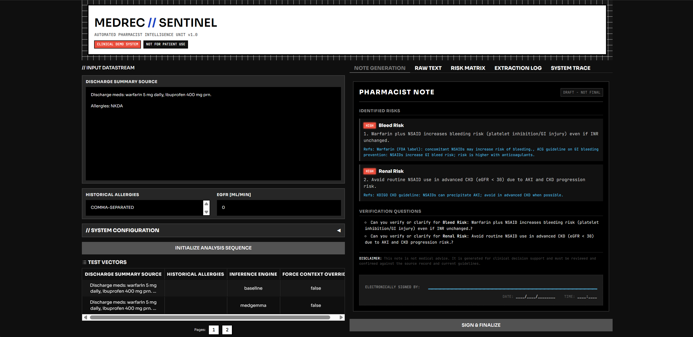

# MedRec Sentinel

Audit-first medication reconciliation for discharge workflows.

[](https://github.com/roivroberto/medrec-sentinel) [](https://github.com/roivroberto/medrec-sentinel) [](https://github.com/roivroberto/medrec-sentinel) [](https://github.com/roivroberto/medrec-sentinel) [](https://github.com/roivroberto/medrec-sentinel) [](https://github.com/roivroberto/medrec-sentinel)

---



---

## About

MedRec Sentinel is an audit-first medication reconciliation system designed to streamline discharge workflows. It leverages **Google MedGemma** as a core extraction engine to identify discrepancies, validate outputs against deterministic safety rules, and generate clinician-ready draft notes. 

Developed as part of the MedGemma Impact Challenge, the project focuses on **agentic workflows** that bridge LLM capabilities with traditional clinical safety checks to ensure reliability in high-stakes medical environments.

## Tech Stack

- **Language:** Python 3.10+
- **LLM Engine:** Hugging Face Transformers & Google MedGemma
- **Validation:** Pydantic
- **UI Framework:** Gradio
- **Testing:** Pytest
- **Quantization:** BitsAndBytes (4-bit support)

## Features

- **MedGemma-Powered Extraction:** High-fidelity clinical data extraction from unstructured discharge notes.
- **Agentic Workflow:** Multi-step pipeline that validates model outputs and runs safety checks.
- **Clinician-Facing Drafts:** Automatically generates pharmacist-ready notes with critical verification questions.
- **Deterministic Safety Engine:** Rules-based engine to catch high-risk medication errors before human review.
- **Comprehensive Evaluation:** Built-in evaluation suite to measure extraction accuracy across clinical cases.

## Getting Started

### Prerequisites

- Python 3.10+
- (Optional) CUDA-capable GPU for running MedGemma locally

### Installation

1. Clone the repository:
   ```bash
   git clone https://github.com/roivroberto/medrec-sentinel.git
   cd medrec-sentinel
   ```

2. Set up a virtual environment and install dependencies:
   ```bash
   python3 -m venv .venv
   source .venv/bin/activate
   pip install -r requirements.txt
   pip install -r requirements-dev.txt
   ```

### Running Locally

To run the baseline evaluation (no model required):
```bash
python3 -m medrec_sentinel.eval.run_eval --data data/synth/cases.jsonl --mode baseline
```

To launch the Gradio demo:
```bash
python3 demo/gradio_app.py
```

## License

This project is licensed under the MIT License.
